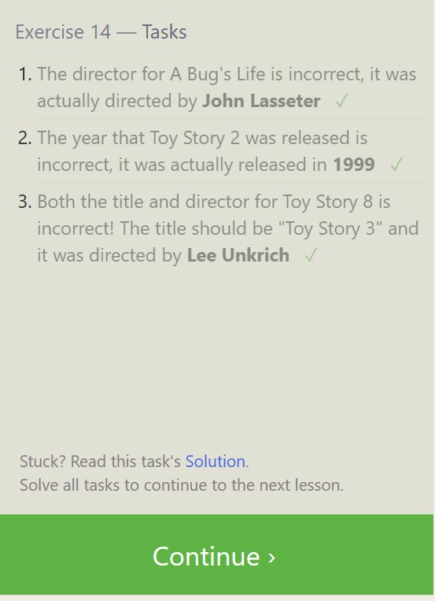

## Code Fellows 401

### Prework Notes

[Home](../README.md)

#### Introduction to SQL

[Learn SQL - SELECT](https://dataschool.com/learn-sql/select/)

[Learn SQL - FROM](https://dataschool.com/learn-sql/from/)

[Learn SQL - ORDER BY](https://dataschool.com/learn-sql/order-by/)

[Learn SQL - LIMIT & OFFSET](https://dataschool.com/learn-sql/limit/)

[Learn SQL - SCHEMA](https://dataschool.com/learn-sql/schema-browsing/)

#### Git Practice

#### Practice in the Terminal

The Linux Command Line:

* Explanation of what the command line is and its advantages over a graphical user interface
* Basic commands such as "ls" (list files and directories), "cd" (change directory), "pwd" (show current directory), "mkdir" (create a new directory), and "rmdir" (remove a directory)
* How to navigate the file system using the command line
* Basic command line editing and history features

Navigation:

* Using the "cd" command to navigate the file system
* Understanding the concept of "absolute" and "relative" file paths
* Using wildcard characters to match multiple files at once
* Understanding the ".." and "." notation for navigating directories

About Files:

* Explanation of the different types of files in a Linux system, including regular files, directories, symbolic links, and special files
* Using the "ls" command to view file properties, such as permissions and timestamps
* Changing file permissions using the "chmod" command

The Manual:

* Explanation of the "man" command and its use for viewing manual pages for different commands
* Understanding the structure of manual pages and how to navigate them

File Manipulation:

* Copying, moving, and renaming files using the "cp," "mv," and "rename" commands
* Creating and editing text files using the "touch," "nano," and "vi" commands
* Using the "rm" command to delete files and directories
* Compressing and uncompressing files using "gzip" and "tar" commands

#### Python Practice

Python seems to be more intuitive that JS in many regards.  I'm excited to start working with a little more structure. ;)

#### Growth Mindset

* Building software doesn't mean you get better at programming every day
* Improving your hard technical skills makes all the software you build better
* It doesn't happen by accident, it requires deliberate practice
* Deliberate practice is activities designed to effectively improve specific aspects of an individual's performance
* Deliberate practice requires pushing yourself just outside your comfort zone, being repeated often, receiving feedback on results, being highly demanding mentally, being difficult, and having good goals.

#### Data Structures

* The 8 common data structures that every programmer must know are:

1. Arrays
Arrays are a collection of elements of the same type, stored in contiguous memory locations, and can be accessed by index.
2. Linked Lists
Linked Lists are a collection of elements called nodes, each node contains a value and a reference to the next node in the list.
3. Stacks
Stacks are a last-in-first-out data structure, that means that the last element added to the stack is the first one to be removed.
4. Queues
Queues are a first-in-first-out data structure, that means that the first element added to the queue is the first one to be removed.
5. Trees
Trees are a hierarchical data structure, it has a root node and child nodes, each node can have multiple child nodes.
6. Heaps
Heaps are a specific kind of tree, they have a specific ordering property, either min heap or max heap.
7. Hash tables
Hash tables are data structures that store key-value pairs, it's used for efficient searching and insertion operations.
8. Graphs
Graphs are a non-linear data structure, it's a set of vertices and edges, it's used to represent a network of relationships.

Each data structure has its own characteristics, advantages and use cases.

#### Things I want to know more about

Emotional intelligence is a hot topic now.  It's important to be able to assess and understand oneself before assessing others though.  Without that it seems pretty ineffective...
